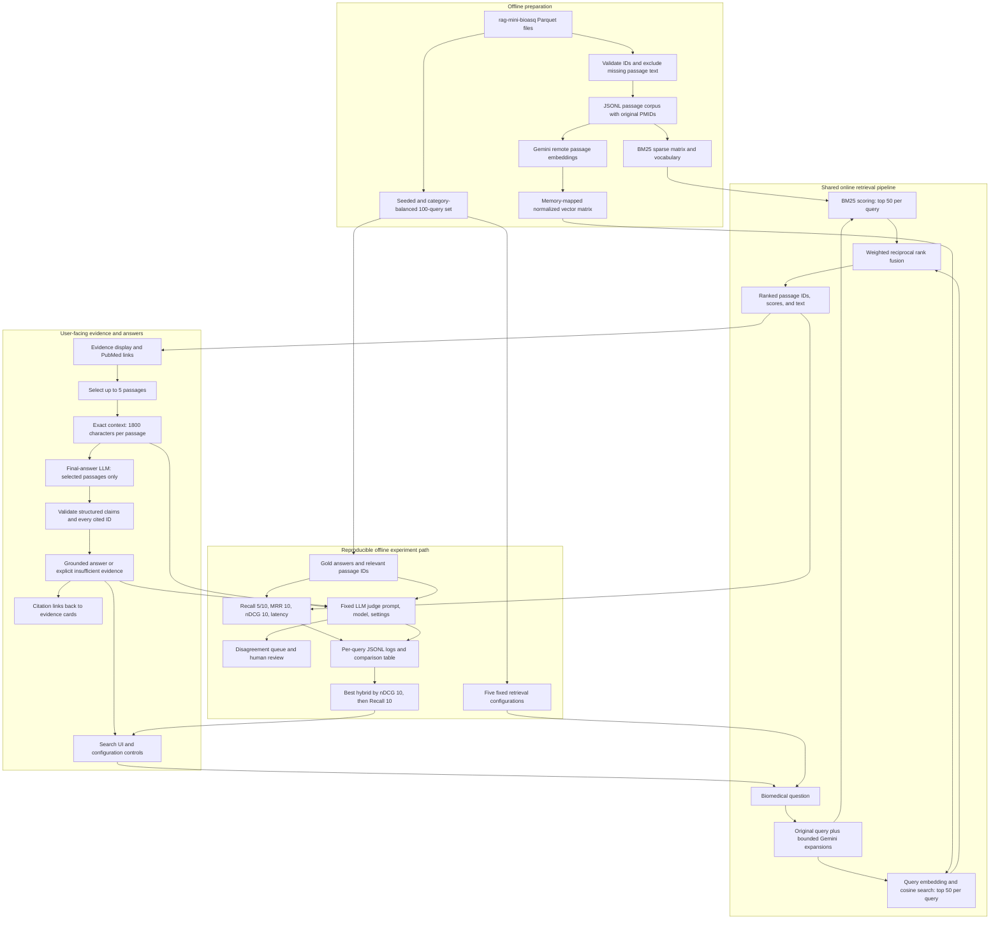

# System design

The final-answer call has no access to gold answers, gold relevance labels, or the rest of the corpus.
Its payload contains only the user's question and the exact selected passage excerpts.
Gold data enters the independent evaluation path only.

Citation validation is enforced in `app/llm.py`, before displaying any model claims. Every claim
must include IDs from the selected context. An invalid ID, empty answered response, or uncontrolled
inline citation causes a fail-closed abstention with a logged validation error. This is structural
validation; semantic support is assessed separately by the judge and human inspection.

The local UI and evaluator both call `SearchEngine.search` in `app/retrieval.py`. All configurations,
ranked passage IDs, scores, original and expanded queries, latency, answer usage, and judge outputs
are recorded. The query set and corpus hashes are saved with each summary for reproducibility.
