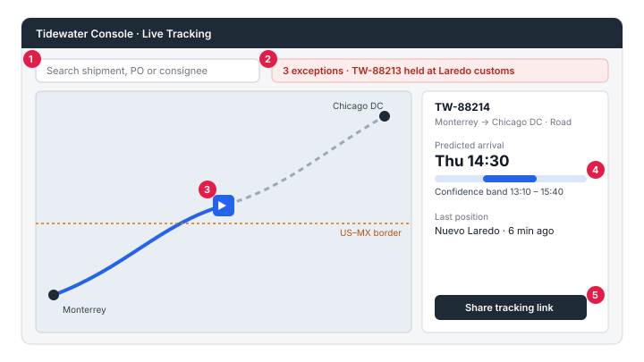
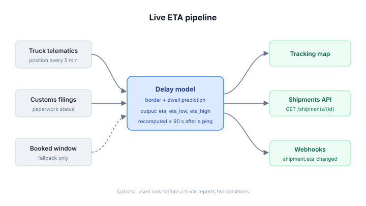
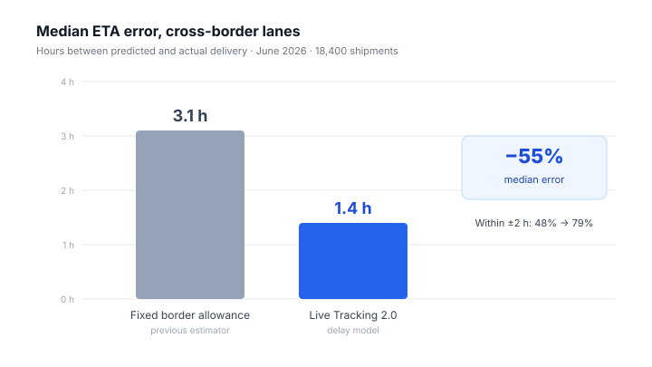
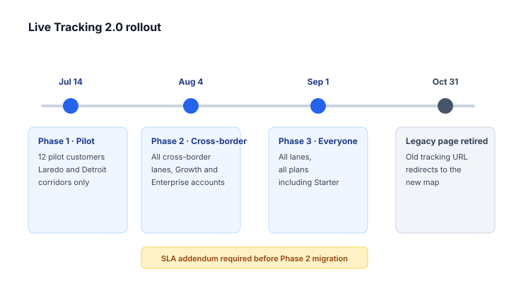
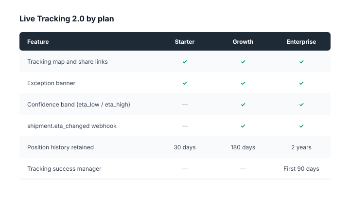

## Slide 1: Live Tracking 2.0

- Customer launch briefing, July 2026
- Tidewater Freight, Product and Customer Success
- Internal and partner use only

> Notes: This is the deck account managers use when walking enterprise customers through the Live Tracking 2.0 launch. It covers the new map, how arrival estimates are now computed, what changes for API integrations, measured accuracy, the rollout schedule and plan availability. Keep the first five minutes on the map, because that is what customers will see first.

## Slide 2: The new tracking map

- One screen for every active shipment
- Live position, predicted arrival, and exceptions together
- Shareable link for consignees

> Notes: Walk through the callouts in order, starting with the search bar and ending with the share button. The exception banner is new and is the feature customers ask about most, because it replaces the old daily exception email. Point out that the confidence band under the arrival time is shown only once a truck has reported at least two positions; before that the screen shows the booked delivery window instead.

## Slide 3: How live ETAs are computed

- Every position update triggers a new estimate
- Border and dwell delays are predicted, not fixed
- Estimates are published to the map, the API and webhooks

> Notes: The old system added a fixed four-hour allowance for every border crossing. The new pipeline replaces that allowance with the late-delivery model from the data science team, which looks at customs paperwork completeness at tender time. Estimates are recomputed within about ninety seconds of a new position ping, and the API now returns the confidence band alongside the estimate itself.

## Slide 4: What changes for integrations

- The estimate now comes from the model stage in the diagram on the previous slide, not from the booked window
- New fields: `eta_low`, `eta_high` and `eta_source`
- New webhook event: `shipment.eta_changed`
- Polling `GET /shipments/{id}` every minute is no longer needed

> Notes: Integration teams should subscribe to the new webhook instead of polling, because the event fires only when the estimate moves by more than fifteen minutes. The old `estimated_delivery` field stays in the payload until v2 is retired, but it is now copied from `eta_high`, so customers who compare it against the booked window will see it move. Send developers to the API changelog for exact payloads.

## Slide 5: Accuracy

- Measured on cross-border lanes, June 2026
- Same shipments, old and new estimator

> Notes: This is the slide customers remember, so let the drop on this chart speak for itself before adding detail. The comparison is on the same set of shipments, scored against actual delivery scans, so it is a like-for-like result rather than a marketing estimate. Domestic lanes improved less, because the old fixed border allowance never applied to them.

## Slide 6: Rollout

> Notes: Read the phases left to right and tell customers which phase their account falls into. Customers with contractual service credits tied to the old estimate must sign the addendum before their account moves to the new estimator. The legacy tracking page stays available until the end of the final phase and then redirects to the new map.

## Slide 7: Plans and availability

- The map is included on every plan
- Confidence bands and the new webhook depend on the plan
- No price change at launch

> Notes: Starter customers keep the map and shareable links but not the confidence band, which is the most common upgrade question so far. Growth and Enterprise customers get every feature, and Enterprise adds a dedicated tracking success manager for the first ninety days. Do not promise feature exceptions on calls; route those requests to the product team.

## Slide 8: Next steps

- Confirm the customer's rollout phase
- Share the API changelog with their developers
- Book a follow-up after their first two weeks

> Notes: Close by agreeing on one owner on the customer side for the integration changes. Log every question you could not answer in the launch tracker so the FAQ can be updated weekly. If a customer reports an estimate that is more than six hours wrong, open a support ticket with the shipment ID rather than escalating by email.
