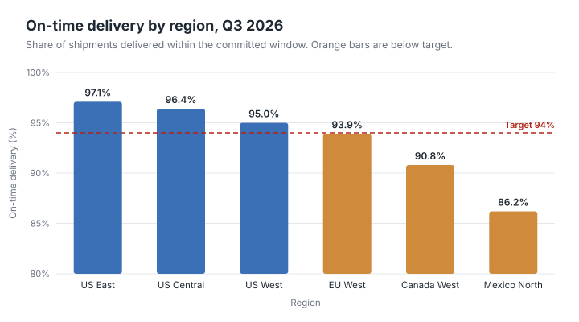
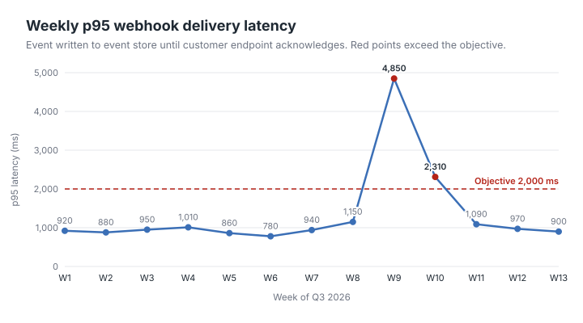
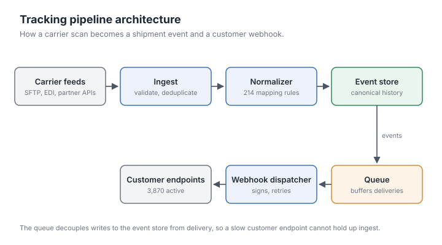
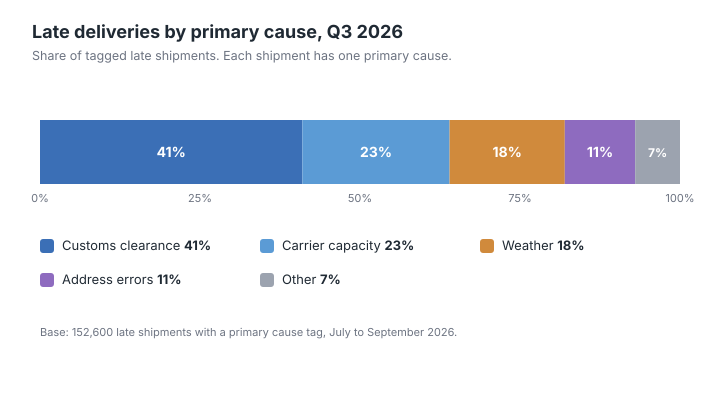

# Q3 2026 network performance report

Tidewater Freight, Network Operations. Report NO-2026-Q3, covering July 1 to September 30, 2026. Prepared for the operations leadership review on October 14, 2026.

This report summarizes how the Tidewater network performed in the third quarter: on-time delivery by region, the latency of shipment status webhooks, the health of the tracking pipeline, and the actions we recommend for the fourth quarter. Figures were exported from the operations dashboards on October 3, 2026.

## Summary

The network delivered 2.31 million shipments in Q3, up 9 percent from Q2. On-time delivery across all regions was 93.4 percent, slightly below the 94 percent target set in the annual plan. Two regions, Mexico North and Canada West, account for most of the gap.

Webhook delivery met its latency objective in eleven of thirteen weeks. The exceptions were weeks 9 and 10, which overlap with incident INC-2291, the webhook dispatcher outage reviewed in September. The tracking pipeline processed 418 million carrier events with a median end-to-end delay of 46 seconds.

Customer-facing impact was concentrated rather than spread out. Support tickets about late deliveries rose 14 percent quarter over quarter, and 61 percent of them came from shippers on Mexico North lanes. Tickets about missing or delayed tracking updates peaked in weeks 9 and 10 and returned to their usual level by week 11.

## On-time delivery

A shipment is on time when it is delivered before the end of its committed delivery window. The quarter's results differ widely by region. Domestic US regions stayed above target, while cross-border regions fell short. Figure 1 compares on-time delivery for the six regions with the most volume, against the 94 percent target.

*Figure 1. On-time delivery by region, Q3 2026, with the 94% target line.*

US East led the network at 97.1 percent and US Central followed at 96.4 percent. Mexico North was the weakest region at 86.2 percent, a drop of 3.5 points from Q2. Canada West reached 90.8 percent, mostly because of wildfire-related road closures in August that rerouted roughly 4,100 shipments.

### Volume and on-time rate by region

| Region | Shipments (thousands) | On-time rate | Change vs Q2 |
|---|---|---|---|
| US East | 612 | 97.1% | +0.4 pts |
| US Central | 488 | 96.4% | +0.2 pts |
| US West | 455 | 95.0% | -0.6 pts |
| EU West | 301 | 93.9% | +1.1 pts |
| Canada West | 214 | 90.8% | -2.7 pts |
| Mexico North | 240 | 86.2% | -3.5 pts |

## Webhook latency

Customers receive shipment status updates as webhooks. Our service objective is a p95 delivery latency under 2,000 milliseconds, measured from the moment an event is written to the event store until the customer endpoint acknowledges it. Latency is measured on every delivery attempt and aggregated weekly.

The dispatcher sent 1.94 billion webhook deliveries in the quarter, to 3,870 active customer endpoints. The first-attempt success rate was 98.1 percent. Most failures were customer endpoints returning 5xx errors during their own deployments, which the retry schedule handles without customer action.

*Figure 2. Weekly p95 webhook delivery latency, weeks 1 to 13 of Q3 2026, with the 2,000 ms objective.*

In Figure 2, weekly p95 latency stays between 780 and 1,150 milliseconds for most of the quarter. The single largest weekly value, in week 9, is discussed under Recommendations, together with the change that caused it.

Retries are not counted as separate deliveries: a webhook that succeeds on its third attempt contributes one latency sample, measured to the successful attempt. Customers whose endpoints were unavailable for more than an hour are excluded from the weekly aggregate, because their latency reflects their own outage rather than ours.

## Tracking pipeline

The tracking pipeline turns raw carrier scans into the shipment events that customers see in the Console, the API and webhooks. It handled 418 million events in Q3, an average of 53 events per second with peaks of about 2,400 per second during the evening scan window.

The diagram below shows how a carrier scan moves through the pipeline. Carrier feeds arrive over SFTP, EDI and partner APIs. The ingest service validates and deduplicates them, the normalizer maps each carrier's status codes to Tidewater's common event model, and the event store keeps the canonical history of every shipment. A queue sits between the event store and the webhook dispatcher so that a slow customer endpoint cannot hold up writes.

*Figure 3. Tracking pipeline, from carrier feeds to customer endpoints.*

The normalizer is the stage most often changed: it holds 214 carrier-specific mapping rules, and 31 of them were added or updated this quarter. Median end-to-end delay from carrier scan to event store was 46 seconds; the p99 was 6 minutes 10 seconds, driven by carriers that send files in hourly batches rather than as a stream.

Each stage reports its own lag to the operations dashboards. Ingest lag stayed under 20 seconds for streaming carriers throughout the quarter. Normalizer errors, meaning carrier status codes with no mapping rule, averaged 0.04 percent of events; unmapped events are parked for review instead of being dropped, and 96 percent of them were mapped and replayed within one business day.

Event store availability was 99.98 percent. The only notable interruption was a 9-minute failover on August 12 during planned database maintenance, during which ingest buffered events and replayed them without loss.

## Late deliveries by cause

Every late shipment is tagged with a primary cause by the exception desk within two business days. The tags are used to route improvement work to the right team, and they are reviewed monthly for consistency. Figure 4 breaks late deliveries down by cause.

*Figure 4. Share of late deliveries by primary cause, Q3 2026.*

The exception desk tagged 152,600 late shipments in the quarter. Tagging coverage was 98.7 percent; the remainder were closed without a cause and are excluded from the breakdown.

Cause tags describe the primary reason only. A shipment held at customs and then delayed by weather is tagged with whichever event first pushed it past its committed window, so the shares understate how often causes combine. The exception desk is piloting a secondary tag in October to measure this.

## Recommendations

**Fix the Mexico North dwell time at the border.** Most of the region's decline comes from shipments waiting at Laredo for customs release. We recommend extending the pilot of pre-filed customs paperwork at tender time from two shippers to all shippers on Mexico North lanes, starting November 1.

**Make the dispatcher queue limits explicit.** As Figure 2 shows, p95 webhook latency rose to 4,850 milliseconds in week 9, more than twice the objective, and stayed elevated at 2,310 milliseconds in week 10 before recovering. The spike followed a configuration change that lowered the dispatcher's worker concurrency during INC-2291. In the architecture in Figure 3, the queue between the event store and the webhook dispatcher absorbed the backlog as designed, but nothing alerted on its depth until customers reported delays. We recommend an alert on queue age above 5 minutes, and a review of any change to dispatcher concurrency.

**Reduce batch-file carriers.** Carriers that deliver hourly batch files account for most of the pipeline's tail delay. We will ask the five largest of them to move to the streaming partner API, which they already support for other customers.

**Tighten address validation at booking.** Of all the causes of late deliveries, address errors are the cheapest to prevent. We recommend enabling the existing postal-code and street-level validation in the booking API for all accounts, not only those that opted in.

**Revisit the on-time target for cross-border lanes.** The 94 percent network target treats cross-border and domestic lanes alike. We recommend separate targets in the 2027 plan, so that improvements on domestic lanes do not hide declines at the border.
