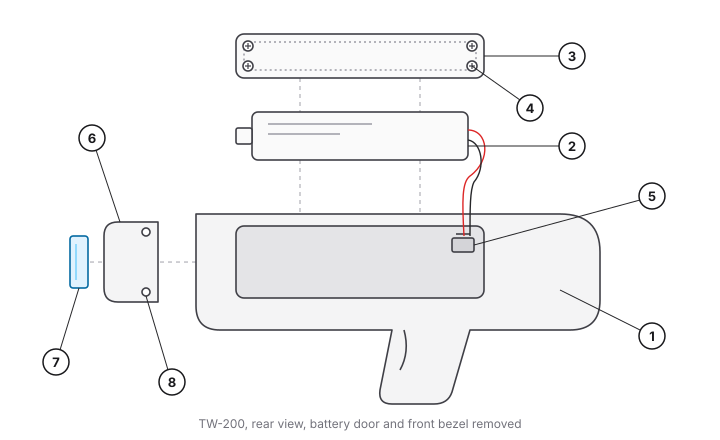
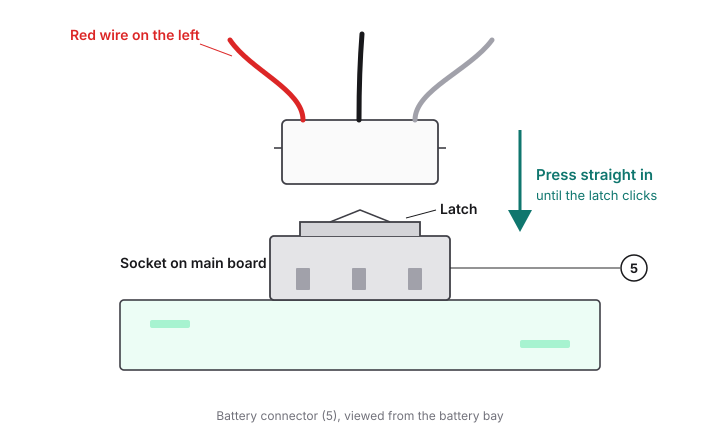

# TW-200 handheld scanner: replacing the battery and the scan window

Service manual SM-TW200-04, revision C. Tidewater Freight field equipment. This page covers the two repairs depot technicians do most often on the TW-200 handheld scanner used by drivers and dock staff: replacing a worn battery pack and replacing a scratched or cracked scan window. Both repairs take under fifteen minutes and need no calibration afterwards.

## Safety

Read this section before opening the scanner.

- Power the scanner off and remove it from the charging cradle before you start. The battery contacts carry charge even when the screen is dark.
- Do not puncture, bend or heat the battery pack. A swollen pack must not be reinstalled; place it in the red lithium recycling bin at the depot.
- Work on an anti-static mat and wear the grounding strap. The scan engine board is sensitive to electrostatic discharge.
- The scan window is polycarbonate, not glass, but a cracked window can still have sharp edges. Handle it by the frame.

## Parts

Figure 1 shows the scanner from the back with the battery door and the front bezel removed. The callout numbers in the figure match the table below. The procedures on this page refer to parts by these callout numbers only.

*Figure 1. Exploded view of the TW-200 handheld scanner, back and nose assemblies.*

| Callout | Part | Part number | Notes |
|---|---|---|---|
| 1 | Scanner housing (rear shell) | TW200-HSG-01 | Not replaced in these procedures |
| 2 | Battery pack, 3.7 V 4,400 mAh | TW200-BAT-44 | Replace when health reads below 70% |
| 3 | Battery door | TW200-DOR-02 | Gasket is part of the door |
| 4 | Battery door screws, M2 × 6 mm (4) | TW200-SCR-26 | Torque 0.25 N·m; replace if the thread is worn |
| 5 | Battery connector and latch | TW200-CON-05 | Part of the main board; see Figure 2 |
| 6 | Front bezel | TW200-BZL-06 | Clips into the housing at four points |
| 7 | Scan window with adhesive gasket | TW200-WIN-07 | Single use; always fit a new gasket |
| 8 | Bezel screws, M1.6 × 4 mm (2) | TW200-SCR-16 | Hidden under the rubber nose bumper |

## Tools

- Torx T5 driver for the battery door screws (4) and the bezel screws (8).
- Plastic spudger. Never use a metal blade on the bezel (6); it marks the housing (1).
- Isopropyl alcohol wipes, 70% or stronger.
- Torque driver set to 0.25 N·m.

## Procedure A: replace the battery

Check the battery health in Settings › Device › Battery before you start. Replace the battery pack (2) when health reads below 70%, or when the pack is swollen.

1. Power off the scanner and lay it face down on the anti-static mat.
2. Remove the four screws (4) and lift the battery door (3) from the bottom edge.
3. Press the latch on the battery connector (5) and pull the battery plug straight out. Do not pull on the wires.
4. Lift the old battery pack (2) out of the housing (1) using the pull tab.
5. Place the new battery pack (2) in the housing with the label facing up and the pull tab toward the bottom edge.
6. Connect the new battery as shown in Figure 2. The plug only fits one way; if you have to force it, it is upside down.

*Figure 2. Battery connector (5): red wire on the left, latch on top, press the plug straight in until the latch clicks.*

7. Check that the gasket on the battery door (3) is seated in its groove all the way around.
8. Refit the battery door (3) and tighten the four screws (4) to 0.25 N·m in a cross pattern.
9. Power on the scanner and confirm that battery health reads 100% and that the clock has kept the correct time.

If the scanner does not power on after step 9, the plug is not fully seated. Remove the door again and repeat steps 6 to 8.

## Procedure B: replace the scan window

Replace the scan window (7) when it is cracked, or when scratches make the scanner miss barcodes it used to read at 30 cm.

1. Remove the battery as in Procedure A, steps 1 to 4. Never work on the nose with the battery pack (2) connected.
2. Peel back the rubber nose bumper to expose the two bezel screws (8) and remove them.
3. Insert the spudger at the lower corner of the front bezel (6) and release the four clips by working around the edge.
4. Push the old scan window (7) out from the inside of the bezel (6). The adhesive gasket comes away with it.
5. Clean the window recess in the bezel (6) with an alcohol wipe and let it dry for one minute.
6. Remove the liner from the new scan window (7) and press it into the recess for ten seconds. Do not touch the optical surface.
7. Clip the bezel (6) back onto the housing (1), refit the two bezel screws (8) and roll the nose bumper back into place.
8. Reinstall the battery as in Procedure A, steps 5 to 9.
9. Scan the test card from 30 cm. All five barcodes must read on the first attempt.

## Troubleshooting

| Symptom | Likely cause | Fix |
|---|---|---|
| Scanner will not power on after a battery swap | Plug not latched on the connector (5) | Reseat the plug as shown in Figure 2 |
| Battery health reads 0% or "Unknown" | Plug inserted upside down | Remove and reinsert with the red wire on the left |
| Moisture inside the nose | Gasket on the scan window (7) reused | Fit a new window with a new gasket |
| Battery door (3) rattles | Screws (4) under-torqued or worn | Tighten to 0.25 N·m or replace the screws |

Return any scanner that fails the test card after Procedure B to the regional repair center with a completed RMA form.
