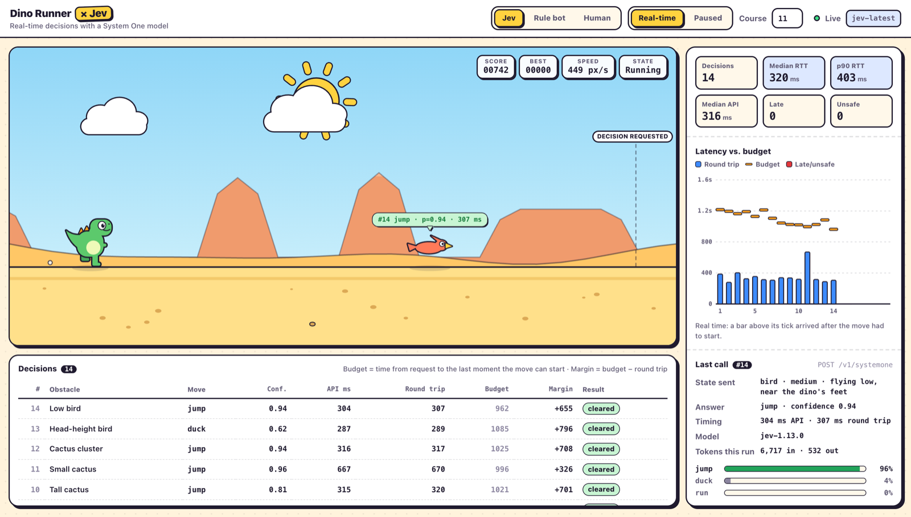

# Dino Runner × Jev: a real-time game player built with a decision model

**Dino Runner** is our own endless-runner game in the style of the Chrome offline dinosaur. You, a lookup-table rule bot, or [TypeSafe's Jev](https://docs.typesafe.ai/introduction) can play it. The example shows how to put a fast decision model inside a real-time loop, and which parts must stay in code.

- **Code** runs the physics, notices each new obstacle, describes it in words, and presses jump or duck at the right moment.
- **Jev** answers one [Choice question](https://docs.typesafe.ai/primitives/choice) per obstacle: `jump`, `duck`, or `run`.

This split follows TypeSafe's own guidance. Jev handles text only, is weak at comparing numbers and timing ([Jev 1.13 known weaknesses](https://docs.typesafe.ai/model-jaggedness/jev-1.13)), and should make narrow decisions rather than run an agent loop ([How to build with System One](https://docs.typesafe.ai/concepts/how-to-build-with-system-one)). Distances, speeds, and frames never reach the model.



*A live real-time run on 2026-09-27: 14 decisions, 320 ms median and 403 ms p90 round trip, none late or unsafe. One local run, not a benchmark.*

**Be clear about what this is.** The rule bot plays perfectly with a lookup table, so the game does not need AI. It is a small, visual test bench for **decision latency**: the same answers that win when the game waits can lose when it keeps running.

## Run locally

Requires **Node.js 22.12+** and npm. No runtime dependencies, model downloads, or special hardware.

From the repository root:

```sh
cd showcase/dino-runner-jev
npm ci
npm start
```

Open **http://127.0.0.1:4318**. Pick a player (**Jev**, **Rule bot**, or **Human**) in the top bar, then press **Space** (or tap the game) to start.

- **Jev:** needs live access (below). Choose **Real-time** or **Paused**. Without live access, the page opens on the rule bot.
- **Rule bot:** answers instantly from a lookup table. A zero-latency baseline; works without any API key.
- **Human:** Space or ↑ to jump, ↓ to duck (ducking mid-air drops faster). On touch screens, tap to jump and hold the ground to duck.

The page fills the browser window without scrolling. The game and the decision log sit on the left and the telemetry sidebar on the right; each scrolls on its own. On narrow screens they stack and the page scrolls.

- **Game stage.** A cartoon runner with a small score/speed HUD. A dashed line marks where the simulation asks for a decision. Each obstacle is tagged with its decision number, move, confidence and round-trip time, coloured by outcome (safe, unsafe, late). While paused mode waits for Jev, a chip says so. The game-over card gives the reason, for example "chose jump for a cactus (#12), but the answer took 810 ms against a 640 ms budget".
- **Telemetry panel.** Headline numbers: decisions, median and p90 round trip, median Jev API time (measured by the server around the API call), late answers, and unsafe moves. The **latency vs. time budget** chart plots each call's round trip as a bar and its budget as a tick, where the budget is the time from the request to the last moment the chosen move can start. **Last call** shows the words-only state that was sent, the answer and confidence, API and round-trip time, the model version, tokens for the run, and the probability of each option. The **decision log** (under the game) lists API time, round trip, budget and margin for every obstacle, plus total tokens.

In paused mode nothing can be late, but the chart still shows the budget real-time play would have allowed. The page uses a 2D cartoon style: flat colours, bold ink outlines and hard offset shadows, with a daytime desert (spinning sun, drifting clouds, parallax buttes and dunes), a googly-eyed dino and coral pterodactyls. It respects `prefers-reduced-motion`. It loads no external fonts or scripts. The canvas draws from the simulation state, so animation (squash and stretch, dust puffs, the crash impact star, screen shake) never changes collisions. Best scores are kept per player in the browser's local storage.

**Sound.** Music and sound effects are synthesised in the browser with the Web Audio API, so there are no audio files to license. The music is an original chiptune loop over a C–Am–F–G progression that speeds up with the run (120 BPM at the start, about 150 at top speed). Effects play for jumps, landings, crashes, every 100 points, and each Jev answer. Browsers allow sound only after a key press or click, so it starts with the first run. Toggle it with the speaker button or **M**; the choice is remembered in local storage.

The **course** number (a seed) fixes the obstacle sequence, so every player faces the same course. AI runs stop after 100 obstacles; human runs are endless. Stop the server with Ctrl-C. `npm run dev` restarts the server when backend source changes; run `npm run build:client` and reload after editing `client/`.

## Enable Jev

```sh
cp .env.example .env
```

Set your own `TYPESAFE_API_KEY` and `ENABLE_LIVE=true`, then restart the server. The key stays on the server: the browser sends only the obstacle kind to `POST /api/decide`, and the server builds the Jev request. Visitors cannot send their own prompts through your key.

| Setting | Purpose |
| --- | --- |
| `TYPESAFE_API_KEY` | TypeSafe API credential |
| `ENABLE_LIVE` | Must be `true` to allow paid calls |
| `TYPESAFE_MODEL` | Defaults to `jev-latest`, a moving alias. Pin a version such as `jev-1.13.0` for published results |
| `TYPESAFE_TIMEOUT_MS` | Per-call timeout, default `5000` (500–30000). No automatic retries |
| `PORT`, `HOST`, `ALLOWED_HOSTS` | Server port (default `4318`), bind address (default loopback) and accepted hostnames |
| `TYPESAFE_INPUT_USD_PER_MILLION`, `TYPESAFE_OUTPUT_USD_PER_MILLION` | Optional token prices for cost estimates. Leave blank if unknown; the cost then shows as unknown, never zero |

**Cost.** Each obstacle costs one Jev call. On 2026-09-26, TypeSafe's [models page](https://docs.typesafe.ai/models) listed $42 per billion input tokens with free output, and 1,200 requests/minute per account. In a local smoke test on 2026-09-26, `jev-1.13.0` reported about 480 input and 38 output tokens per call. At the listed price, a 100-obstacle game (about 48,000 input tokens) costs roughly $0.002. The actual token counts are in each response's `usage`. Check current pricing and your actual bill before quoting costs. The server allows at most 4 Jev calls in flight and 300 per minute.

## How a decision works

1. An obstacle scrolls into view. Code sends Jev a description with no numbers, for example:

   ```json
   { "obstacle": { "type": "bird", "size": "medium", "position": "flying at the dino's head height" } }
   ```

2. The Choice question describes what each move physically does, not which obstacle it suits. Jev returns a choice, a probability for each option, and a confidence value.
3. Code waits for the right moment and performs the move. A jump is timed so its peak lines up with the obstacle; a duck starts 0.1 s before the obstacle arrives.

If a Jev call fails, the run stops with the error shown. The game never substitutes a move, because a fallback would hide the failure.

### Real-time vs paused

- **Paused while deciding:** the game freezes until Jev answers. This measures the choice alone.
- **Real-time:** the game keeps running. An answer that arrives after the latest moment to start the move is marked **late**, and physics decides whether the dino survives.

The decision is requested as soon as the obstacle is on screen. The time left to act shrinks as the game speeds up: about 1.3 s at the start and about 0.43 s at top speed (for a jump). In simulation, the rule bot with a fixed 400 ms delay still clears 60 obstacles (5 marked late). With 700 ms it crashes at obstacle 40; with 1,100 ms, at obstacle 15. For comparison, the travel-planner example in this repository measured Jev routing calls at a 396 ms median and 1,104 ms at the 90th percentile. That was a different task, account setup, and network, so it predicts nothing precise here.

### Which moves are correct?

Correct moves are **computed by simulation**, not hand-labelled: each move is played against each obstacle at the start speed and at top speed.

| Obstacle | Safe moves |
| --- | --- |
| Small, tall, or clustered cactus | jump |
| Low bird (near the feet) | jump |
| Head-height bird | jump or duck |
| High bird (above the head, higher than the jump's peak) | duck or run |

The table also shows the example's main limitation. Jev only ever sees six distinct obstacle descriptions, so its choices repeat and the task is easy by design. Latency is the interesting measurement. Harder variants could describe several obstacles at once or add distracting details.

## Verification

Run inside this project:

```sh
npm test
npm run check
npm run benchmark
```

Tests make no API calls. They cover:

- seeded courses and spacing
- jump and duck physics, collisions, and the jump trigger point
- the simulated safe-move table and the rule bot clearing long courses
- late and missing answers
- the Jev request shape, and rejection of invalid answers, HTTP errors, and timeouts, with error messages that never echo upstream bodies or keys
- server host checks, input validation, malformed request paths (a 400, not a crash), the disabled-live response, and the in-flight limit

`check` type-checks TypeScript. The browser page was also checked in headless Chrome: ready, playing and game-over states for human, rule bot, and Jev (both modes, with a fake server and live), at 1512×860, 1280×720 and 390×844, and with Chrome's forced dark mode on. It fitted the window (desktop) or the width (phone) with no console errors.

### Benchmark

`npm run benchmark` validates the fixed dataset without API calls. The dataset is 5 seeds × 30 obstacles, and the command prints its hash and the planned call count. With live access configured, the paid run is:

```sh
npm run benchmark -- --live               # 150 sequential Jev calls
npm run benchmark -- --live --repetitions 3
```

The runner asks Jev about each obstacle in course order, one call at a time, with no retries. It then replays each course twice:

- **Paused:** every answer arrives instantly.
- **Real-time replay:** each answer arrives after its own measured latency in game time.

The report includes accuracy against the simulated safe moves, errors, median/p90/max latency, choices per obstacle kind, cleared obstacles in both replays, late answers, tokens, the returned model version, and the rule bot baseline. It is saved to the Git-ignored `.runs/benchmarks/`. The replay measures latency on the machine running the benchmark; in the browser, latency also includes the trip to this project's server. **No live benchmark has been run yet**, so this README makes no claim about Jev's accuracy or speed on this task. A local connectivity smoke test on 2026-09-26 answered one call per obstacle kind (all six moves safe, 336–625 ms) and played one paused-mode browser game on seed 11 (25 obstacles cleared, no unsafe moves, 375 ms median round trip) before it was stopped. That is a working check, not a measurement.

## Code map

- `src/game.ts`: seeded courses, physics, collisions, the autopilot that times moves, headless simulation, and the safe-move check.
- `src/players.ts`: the obstacle-to-words mapping, the Choice question text, and the rule bot.
- `src/jev.ts`: configuration and the Jev API call (plain `fetch`, no SDK, so the request is visible).
- `src/server.ts`: local HTTP server, static files, and `POST /api/decide`.
- `src/benchmark.ts`, `scripts/benchmark.ts`: fixed dataset, live collection, replays, and summary.
- `client/app.ts`: game states, input, HUD, best scores, Jev requests, and per-decision budget calculation.
- `client/scene.ts`: canvas renderer for the stage (dino, obstacles, decision tags, request line). It reads positions from the simulation and never changes them.
- `client/telemetry.ts`: headline numbers, latency-vs-budget chart (SVG), last call, and decision log.
- `client/audio.ts`: synthesised music loop and sound effects, with a mute setting.
- `public/` holds the HTML/CSS and the generated `app.js`; `docs/screenshot.png` is the image above.
- `tests/`: offline tests.

## Sources and attribution

- [TypeSafe introduction](https://docs.typesafe.ai/introduction), [API reference](https://docs.typesafe.ai/api.md), [Choice](https://docs.typesafe.ai/primitives/choice), [models, pricing and limits](https://docs.typesafe.ai/models), [Jev 1.13 known weaknesses](https://docs.typesafe.ai/model-jaggedness/jev-1.13), [How to build with System One](https://docs.typesafe.ai/concepts/how-to-build-with-system-one)
- Game idea: Chrome's offline dinosaur game. No Chrome code, sprites, or sounds are used. The game, physics constants, and shapes are written for this example.
- Related example: [Travel Lab](../../agents/travel-planner-gemini-typesafe/README.md) uses Jev for agent and tool routing.

The repository has not selected a license yet. No project-specific community discussion is linked yet.
